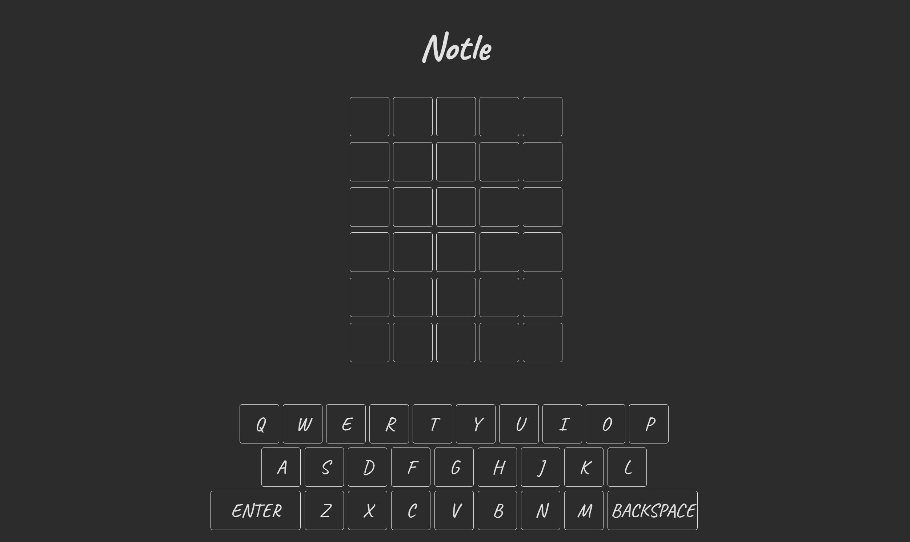

# Notle

## Table of Contents

* [Description](#description)
* [Links](#links)
* [Screenshots](#screenshots)
* [Installation Instructions](#installation-instructions)
* [Usage](#usage)
* [Technologies Used](#technologies-used)
* [Tests](#tests)
* [Credits](#credits)
* [Contributing](#contributing)
* [Questions](#questions)
* [Badges](#badges)

## Description

This application uses jQuery Mobile to build a Wordle clone.

## Links

[Notle](https://lauracole1900.github.io/notle/)

## Screenshots

Landing page:

## Installation Instructions

npm i

## Usage

This project is intended to be used for casual gaming.

## Technologies Used

   

## Tests

npm run test

## Credits

Wordle was created by Josh Wardle

normalize.css from [necolas](https://github.com/necolas/normalize.css/)

## Contributing

We believe code is never finished, and welcome your contributions to enhance the application's functionality. Please adhere to the Code of Conduct for the Contributor Covenant, version 2.0, at https://www.contributor-covenant.org/version/2/0/code_of_conduct.html.

## Questions

If you have further questions, you can reach me at lauracole1900@comcast.net. For more of my work, see [my GitHub](https://github.com/LauraCole1900).

## Badges

